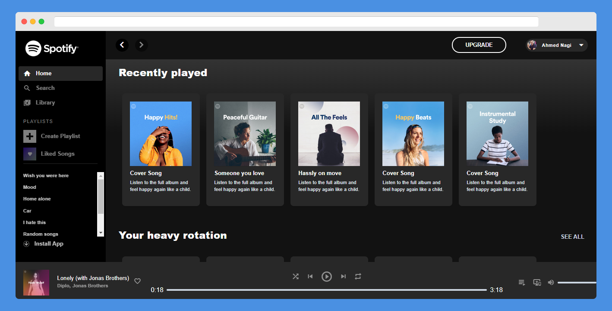
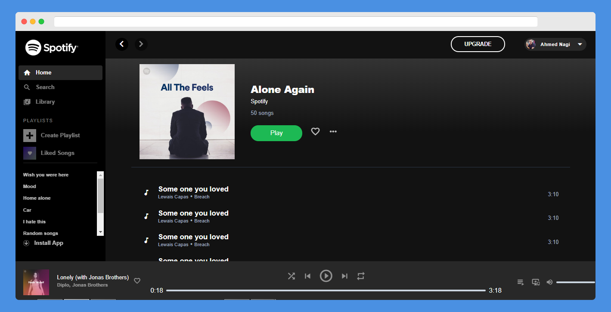

<!-- Graphics or Logo-->

<!-- Title and slug-->

# Spotify Clone

> Clone of the current [Spotify](https://spotify.com) created with [Tailwind CSS](https://tailwindcss.com)

 

**_Album page_**

---
## td;lr

> This project aims to duplicate only the design of current Spotify design for educational and reference purposes **aka _just for fun_**. If you are intrested please read the [Todo List](#todo-list) section.

> [Contributing](#contributing)  are welcome to complete this porject.

---

## Table of Contents

- [Spotify Clone](#spotify-clone)
	- [td;lr](#tdlr)
	- [Table of Contents](#table-of-contents)
	- [Features](#features)
	- [Getting started](#getting-started)
	- [Documentation](#documentation)
		- [PostCss config](#postcss-config)
	- [Contributing](#contributing)
		- [Step 2](#step-2)
		- [Step 3](#step-3)
	- [Todo List](#todo-list)
	- [License](#license)

---

## Features

- [Tailwind CSS](https://tailwindcss.com)
- Almost typical to Spotify
- Material Icons
- Desktop responsive

## Getting started

**I use yarn** 

- For development

  `yarn build` Or `yarn build --watch`

- For Production
    
    `yarn production`
---

## Documentation

### PostCss config

 - **In production `yarn production`**
    - PurgeCss
    - cssnano

will minifiy the whole bundle into 6kb!

---

## Contributing

> To get started...

- Take a quick look on [Todo List](#todo-list)
- Open issue to share and discuses new ideas or features.

### Step 2
  - Fork this repo!
  - Commit to the [develop](https://github.com/nagi1/twitter-clone/tree/develop) branch

- **Do your thing.**

### Step 3

- Create a new pull request

---

## Todo List

- [ ] Add NPM support
- [ ] Edit the Readme.md
- [ ] Create community
- [ ] Create mobile version
- [ ] Functional player
- [ ] Fix Mobile version
- [ ] Extract to vue components
- [ ] un-Spaghetti the code!
- [ ] add search page
- [ ] add settings page

---

## License

